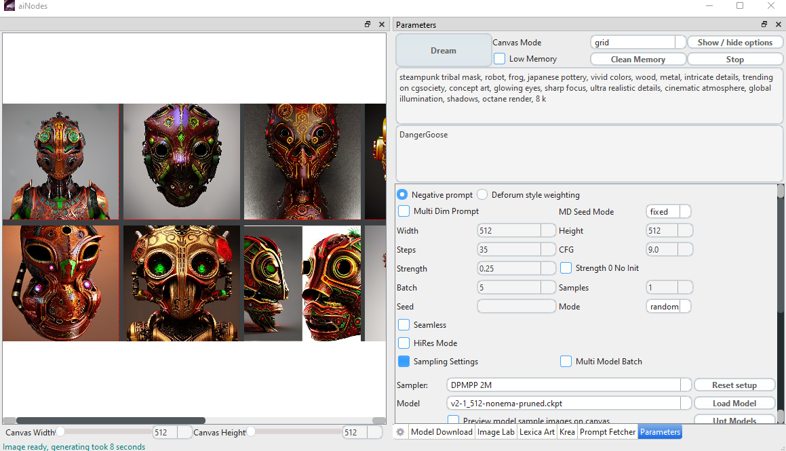

# aiNodes - Stable Diffusion Desktop

  

Colab API Server added with limited functionality

Please join our Discord for further information: https://discord.gg/XDQm9pk5pd

Welcome to aiNodes, a desktop GUI with Deforum Art, Outpaint, Upscalers, and many more.

This product does not yet have a sophisticated installer mechanics.
So you have to follow the few but very simple installation steps

1. Install Conda, download from here https://docs.conda.io/en/latest/miniconda.html
2. Install [git](https://git-scm.com/download/win).
3. Once Conda is installed start the conda prompt from start menue. Use the Conda prompt not the Conda powershell.

4. from with in the conda prompt you follow thi steps:
5. clone your copy of aiNodes with git clone https://github.com/XmYx/ainodes-pyside
6. Cd to your copy of aiNondes

7.	Run clean_install.bat as normal, non-administrator, user.

8. This will run quite a while and do all the necessary steps to get the application installed and finally started for the first time.

any further start can be made by start.bat it will just fire up the app and do not do any updates.

F.A.Q:

1. I have the following error: RuntimeError: failed to find interpreter for Builtin discover of python_spec='python3.10'
Solution: Please make sure you have Python version 3.10 installed on your system and added to your PATH, or in your conda environment you are running the launcher from.
https://realpython.com/add-python-to-path/
2. I have an access denied error when downloading the files from huggingface to the user\.cache folder
Solution can be to rename the existing folder to allow creating a new one, delete the existing one is kind the same but more agressive
also you can use HF_DATASETS_CACHE="/path/to/another/directory" as environment variable to point to a different folder

