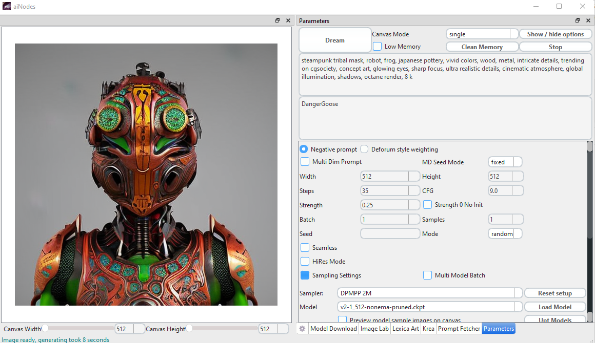

This short text should help you to get the aiNodes up and running on your windows machine

first of all there is two things you must have on your system:
1. you need to have the latest pull from ai Nodes on your system, you might be there already as you are reading this text ;)
2. you need to have a working installation of miniconda, you can get the installer from here https://docs.conda.io/en/latest/miniconda.html

If those two things are prepared we need to prepare a initial environment which will allow to install the rest of the aiNodes app.

To do so you open the Anaconda Prompt, for now dont use the powershell version, we did not test the install with that
So use this one 

cd to your folder where you cloned the repo of aiNodes

run the following command
conda env create -f environment-installer.yaml

Something very similar to this should happen

After some time, depending on your system and internet connection you should see this on your screen

now we move into our new created environment by doing

conda activate ai-pixel

once you activated the environment it is time to run the setup.bat which will do the rest of the install and at the end run the application

if anything went as expected you should then see the splash screen poping up and after some more time you shall see the app in all its beauty

and finally you see this

Now is the time to put your model(s) in place 
The default setup does expect the models to be at data/models
We have an extra folder for custom models in data/models/custom

for any your model you need to provide a config yaml file with the same name as the model but you change ckpt to yaml
do not rename your model ;) just put a yaml file in place. for the most comon original SD Models the yaml files are in place already, for some of the custom models we put some examples
Please be aware that our configs have been changed to fit into our complex arangement, so you can not just use the original config files from SD. please use those from us.

If you use the downloader to download some model you can choose what config may fit best and it will be created automticaly.
so if any worked acording to the plan and the experience of the guy writing the text yoiu should be able to render your first image 

If for what ever reason you did not get here and you experience any issue please feel free to meet us in our discord server and we will try to help you. We are not available 24/7 so please give us little time to come back to you, we will do, so much I can promisse you.

If you are ready to render, all I can tell anymore is be happy have fun and create some awesome art, maybe you share some of it in our showroom.
Also youre welcome to join us on our patreon page which you will find here: https://www.patreon.com/ainodes
